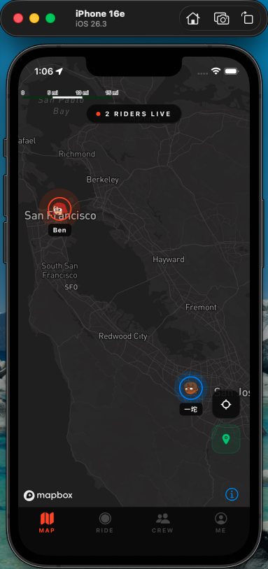
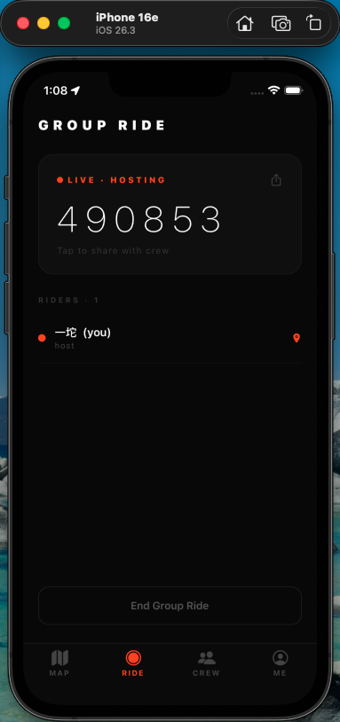
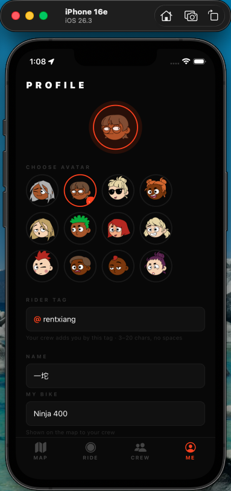

# Crew

> Live group‑ride tracking for motorcyclists.

Crew lets riders see their whole group on one live map, talk hands‑free with
push‑to‑talk voice, and follow a leader's planned route — built for the riding
culture, inspired by Zenly and Apple Find My.

  

---

## Features

- **Live location sharing** — one‑tap toggle; keeps updating in the background
  (even while you're in Google/Apple Maps navigating) with "Always" location
- **Crew system** — add riders by their `@ridertag`; friend **requests** with
  accept / reject, avatars, and pending/sent states
- **Group ride rooms** — 6‑digit code, anyone can join without being friends;
  rooms auto‑expire after 12h and clean themselves up
- **Leader route planning** — search places (POI/business), drop pins by tapping
  the map, drag to reorder stops, snap‑to‑road preview; the route is shared live
  to the whole room and one tap hands the full multi‑stop route to Google Maps
- **Push‑to‑talk voice** — hold your avatar to record a voice message that pops
  on your map marker; tap to listen, marked as read, gone in 24h
- **Map themes** — sleek dark by default, switch to a daytime map with rich POIs
- **Marker language** — you = orange, roommates = amber, friends = blue, offline
  = greyed "last seen"; smooth grow/shrink animations
- **First‑run onboarding**, keep‑awake while riding, dark premium UI

---

## Tech Stack

| Layer | Technology |
|---|---|
| Framework | React Native + Expo SDK 54 |
| Language | TypeScript |
| Navigation | Expo Router (file‑based) |
| Map | Mapbox (`@rnmapbox/maps`), Search Box + Directions APIs |
| Backend | Supabase (PostgreSQL, Realtime, Storage) |
| Auth | Supabase Auth — Apple, Google (native), email |
| Location | `expo-location` + `expo-task-manager` (foreground + background) |
| Audio | `expo-audio` (voice messages) |
| State | React Context (`LocationSharingContext`, `OnboardingContext`) |
| Build / OTA | EAS Build, EAS Update, TestFlight |

---

## Architecture

```
app/
├── _layout.tsx          # Root layout, auth + onboarding routing, deep links
├── onboarding.tsx       # First-run carousel (shown once)
├── login.tsx            # Apple / Google / email sign in (email collapsible)
├── auth/callback.tsx    # Supabase email-verification deep-link handler
└── (tabs)/
    ├── index.tsx        # Map — rider markers, route, voice PTT, theme toggle
    ├── ride.tsx         # Group ride room — code, members, route card
    ├── friends.tsx      # Crew — requests, sent/pending, last-seen
    └── profile.tsx      # Profile, avatar, account deletion, privacy policy

services/
├── supabase.ts          # Supabase client
├── location.ts          # GPS tracking (fg watch + bg task), location upsert
├── friends.ts           # Friend requests (pending/accepted)
├── rooms.ts             # Group ride rooms (expiry-aware)
├── routes.ts            # Route storage, Search Box geocoding, Directions
├── voice.ts             # Voice upload/fetch/signed-url (Supabase Storage)
└── profile.ts           # Profile, avatar URL, account deletion

contexts/
├── LocationSharingContext.tsx  # Sharing state (local-first), room, route toggle
└── onboarding.tsx              # First-run flag + markSeen

components/
├── RiderMarker.tsx      # Animated avatar marker, voice bubble, last-seen
├── VoicePTTButton.tsx   # Hold-to-talk recorder
└── RouteEditor.tsx      # Leader route editor (search, map-tap, drag, preview)
```

---

## Key technical decisions

**Privacy via RLS** — `locations` and `voice_messages` are only readable by your
**accepted friends** or members of a **non‑expired room** you're in. Realtime is
enabled per table; expired rooms stop granting visibility.

**Local‑first sharing state** — sharing status is persisted locally (`@crew/sharing`)
for an instant correct UI on launch, with the DB as the authoritative record.
A busy‑lock serializes rapid start/stop taps so tracking and UI never diverge.

**Background location** — `expo-task-manager` keeps location flowing when the app
is backgrounded (e.g. switching to a nav app); on cold force‑kill iOS stops it and
the rider stays on the map at their **last‑seen** spot.

**Server timestamps** — a trigger sets `locations.updated_at = now()` so freshness
("last seen") doesn't depend on device clocks.

**Route planning, not navigation** — Crew shows the planned road‑snapped route
(Mapbox Directions) and hands turn‑by‑turn off to Google/Apple Maps; it never
re‑implements navigation.

**Ephemeral voice** — one clip per rider (overwrite), 24h client window, read
state stored locally per viewer.

---

## Database schema (high level)

```sql
users         id, email, name, username (unique), bike, avatar_seed
friends       id, user_id, friend_id, status ('pending' | 'accepted')
locations     user_id (pk), lat, lng, heading, speed, is_sharing, updated_at
rooms         id, code (6-digit), host_id, expires_at (now()+12h)
room_members  room_id, user_id            -- ON DELETE CASCADE from rooms
room_routes   room_id (pk), waypoints jsonb, geometry jsonb, created_by
voice_messages user_id (pk), audio_path, duration, created_at
```

RLS restricts location/voice/route reads to friends + current roommates. Helper
SQL: `set_updated_at` trigger, `delete_user()` (account deletion), and a `pg_cron`
job that deletes expired rooms. Voice audio lives in a private `voice-messages`
Storage bucket.

---

## Getting started

### Prerequisites

- Node.js 20+
- Xcode (for iOS)
- [Mapbox](https://mapbox.com) account, [Supabase](https://supabase.com) project
- Apple Developer Program (for Apple Sign In, background location, TestFlight)

### Setup

```bash
npm install
```

Create a `.env` (never commit this):

```
EXPO_PUBLIC_MAPBOX_KEY=your_mapbox_public_token
EXPO_PUBLIC_SUPABASE_URL=your_supabase_url
EXPO_PUBLIC_SUPABASE_ANON_KEY=your_supabase_anon_key
EXPO_PUBLIC_GOOGLE_IOS_CLIENT_ID=...
EXPO_PUBLIC_GOOGLE_WEB_CLIENT_ID=...
EXPO_RNMAPBOX_MAPS_DOWNLOAD_TOKEN=your_mapbox_download_token
```

Run on a device:

```bash
npx expo run:ios --device
```

Ship to testers:

```bash
eas build --platform ios --profile production
eas submit --platform ios --latest
```

> JS‑only changes can ship over the air with `eas update --branch main`. Anything
> touching native modules or `app.config.js` needs a rebuild.

### Supabase

Enable Realtime for `locations`, `friends`, `users`, `voice_messages`,
`room_members`, `room_routes`. Apply the RLS policies (friends/roommates only),
the `set_updated_at` trigger, the `delete_user()` function, the expired‑room
`pg_cron` job, and create the private `voice-messages` Storage bucket.

---

## License

MIT
