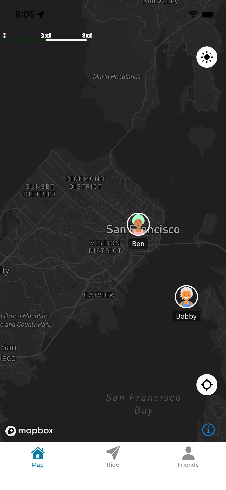

# Welcome to Ride9 👋



## Features:

- **Cross-platform compatibility**: Built with React Native and Expo, the app runs seamlessly on both iOS and Android devices.
- **Real-time location tracking**: Utilizes `expo-location` and `@rnmapbox/maps` for precise and real-time location updates.
- **Friend system**: Includes a robust friend management system with features to add, remove, and track friends' locations.
- **Supabase integration**: Leverages Supabase for authentication, database management, and real-time updates.
- **Modern JavaScript**: Developed using the latest ES6+ features and TypeScript for type safety and better developer experience.
- **Custom map integration**: Powered by Mapbox for interactive and customizable maps with real-time updates.
- **Responsive design**: Optimized for various screen sizes and orientations with a clean and intuitive UI.
- **Dark mode support**: Includes light and dark themes for better user experience in different environments.
- **Fast development**: Built with Expo for rapid prototyping, testing, and deployment.
- **Active community support**: Supported by Expo's extensive ecosystem, documentation, and community resources.

Important: Node version used: v20+

This is an [Expo](https://expo.dev) project created with [`create-expo-app`](https://www.npmjs.com/package/create-expo-app).

## Get started

1. Install dependencies

   ```bash
   npm install
   ```

2. Start the app

   ```bash
   npx expo start
   ```

3. Or for the simulator start

```bash
npx expo prebuild
npx expo run:android
npx expo run:ios
```


